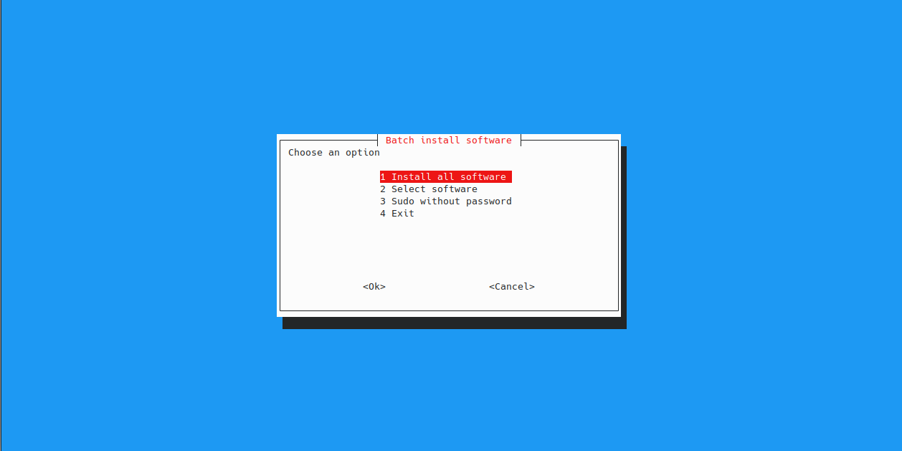
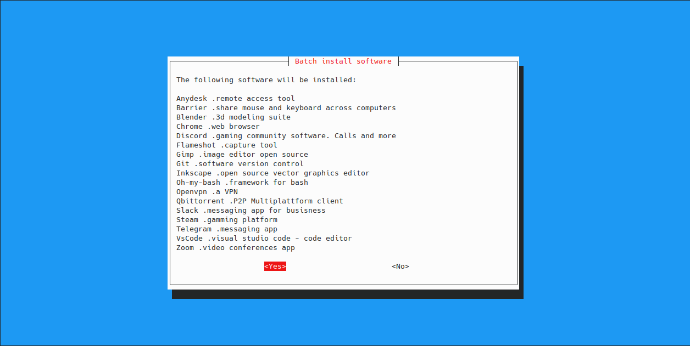
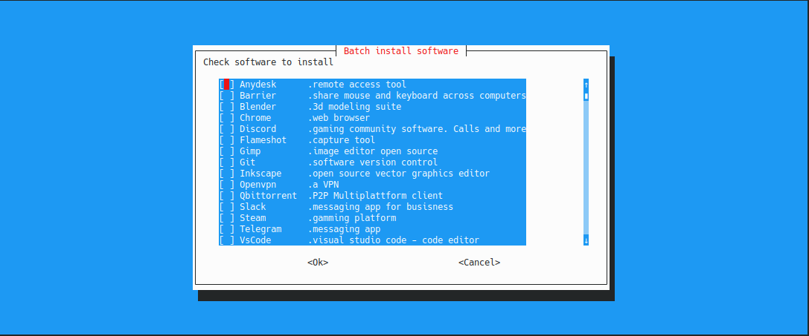
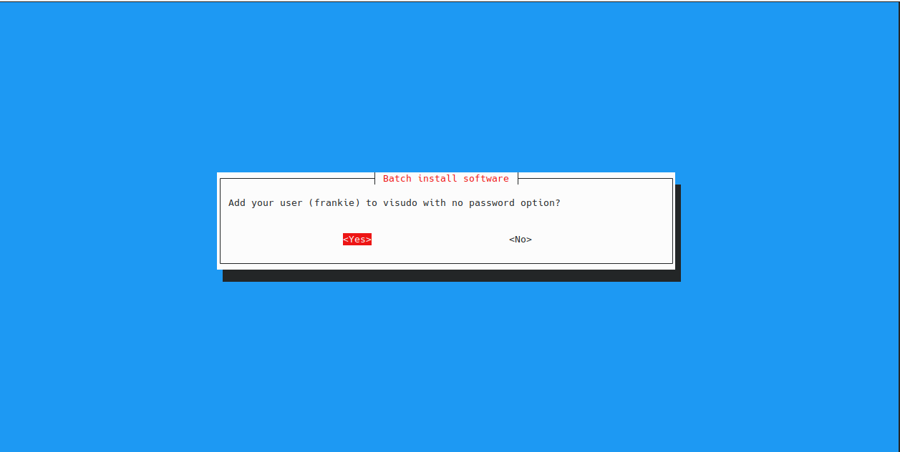

# ABOUT
Inspired by ninite on windows and for a personal necesities i made this tool for install unantended software selection.This is a weekend project and can be re-used for free or can send yours PR. *Pourly tested on Kubuntu 20.04LTS 😅*

## SOFTWARE INCLUDED

| Software | Description |
|--|--|
| Anydesk | remote access tool|
|Barrier|share mouse and keyboard across computers|
|Blender|3d modeling suite|
|Chrome|web browser|
|Discord|gaming community software. Calls and more|
|Draw.io|diagramming application|
|Flameshot|capture tool|
|Gimp|image editor open source|
|Git|software version control|
|Inkscape|open source vector graphics editor |
|Oh my bash|framework for bash| 
|Openvpn|a VPN |
|Qbittorrent|P2P Multiplattform client|
|Slack|messaging app for busisness|
|Steam|gamming platform|
|Telegram|messaging app|
|VsCode|visual studio code - code editor|
|Zoom|video conferences app|


## FASTEST WAY
```
curl -s https://raw.githubusercontent.com/frankietoledo/    InstallTool/master/app.sh | sudo bash -s
```
## USAGE

 1. Clone the repo or download the .sh file
 2. Open a terminal and run the script as root

```
sudo ./app.sh
```

 3. Choose an option: Install all software or select what will be installed
 4. Now edit sudoers and configure it's possible, add your user to use sudo without password

## SNAPSHOTS





## CONTACT ME
|[](https://twitter.com/frankie_toledo)|[](https://www.linkedin.com/in/frankie-toledo/)|
|--|--|